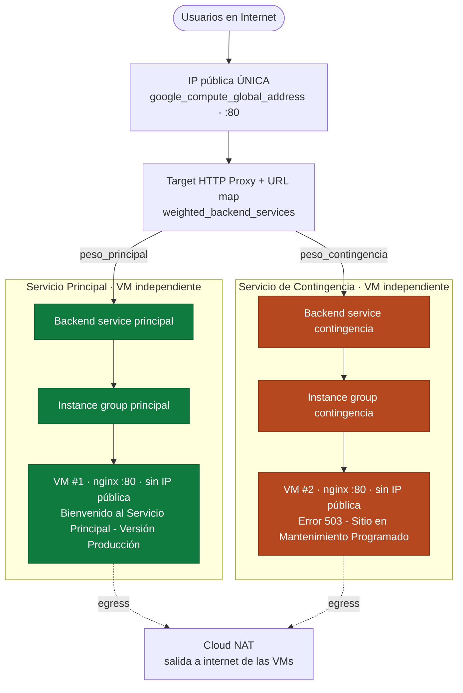

# Proyecto Terraform — Servicios en la Nube 2026-01

Infraestructura como Código (IaC) en **Google Cloud Platform** que despliega, con un
solo `terraform apply`, un **Application Load Balancer externo global** capaz de
repartir el tráfico de una **única IP pública** entre dos servicios alojados en
**máquinas virtuales independientes**:

- **Servicio Principal (Producción):** muestra `Bienvenido al Servicio Principal - Versión Producción`.
- **Servicio de Contingencia (Mantenimiento):** muestra `Error 503 - Sitio en Mantenimiento Programado`.

El reparto de tráfico se controla **únicamente con dos variables de peso**
(`peso_principal` y `peso_contingencia`), sin tocar la consola web ni reescribir
código.

---

## Arquitectura



**Por qué este diseño cumple cada requisito:**

| Requisito del enunciado | Cómo se cumple |
|---|---|
| Punto de entrada único | Una sola `google_compute_global_address`; las VMs no tienen IP pública. |
| Servicios en VMs independientes (aislamiento de fallos) | `google_compute_instance.principal` y `...contingencia` son recursos y máquinas distintas, además en **zonas distintas** (`zona_principal` / `zona_contingencia`). Destruir una no afecta a la otra. |
| Control de tráfico por variables | `weighted_backend_services` en el `url_map` usa `var.peso_principal` y `var.peso_contingencia`. |
| Automatización absoluta (sin SSH/consola) | `metadata_startup_script` instala nginx y publica la página en el arranque. |
| Optimización de costos | VMs `e2-micro` (Free Tier), disco `pd-standard` de 10 GB. |
| IP interna oculta | VMs sin IP pública; salida a internet por Cloud NAT. |

> **Tipo de balanceador:** se usa el **Application Load Balancer externo global**
> (`load_balancing_scheme = "EXTERNAL_MANAGED"`), el único que soporta *traffic
> splitting* por pesos. Por eso se crea una **subred proxy-only**
> (`purpose = GLOBAL_MANAGED_PROXY`), requisito de este tipo de balanceador.

---

## Estructura del repositorio

| Archivo | Contenido |
|---|---|
| `providers.tf` | Provider de Google y versiones requeridas. |
| `variables.tf` | Todas las variables (con defaults): `project_id`, región/zona y los pesos de tráfico. |
| `services.tf` | Habilita la API de Compute Engine (despliegue desde cero). |
| `network.tf` | VPC, subred, subred proxy-only, firewall, Cloud Router + NAT. |
| `compute.tf` | Las 2 VMs independientes + sus instance groups + startup scripts. |
| `loadbalancer.tf` | IP global, health check, backend services, URL map con pesos, proxy y forwarding rule. |
| `outputs.tf` | IP pública y datos útiles tras el despliegue. |
| `templates/startup.sh.tftpl` | Script de arranque que instala nginx y publica el mensaje. |

---

## Requisitos previos

1. **Terraform** >= 1.9 instalado.
2. **gcloud CLI** autenticado con una cuenta con permisos de Editor en el proyecto:
   ```bash
   gcloud auth application-default login
   ```
3. Un **proyecto de GCP** con facturación activa (los $300 de crédito gratuito bastan).

---

## Cómo desplegar

El `project_id` (y la región/zona) ya vienen como **valores por defecto** en
`variables.tf`, así que **no hace falta crear ningún `terraform.tfvars`**: el
despliegue funciona con un solo `terraform apply`.

```bash
terraform init      # obligatorio una vez (descarga el provider de Google)
terraform plan      # buena práctica: revisar qué se va a crear
terraform apply     # aplica (muestra el plan de nuevo y pide confirmación)
```

> `terraform plan` es opcional pero recomendado. `terraform apply` ya calcula el
> plan internamente y pide confirmación antes de crear nada.

Al terminar, Terraform imprime la **IP pública**. Espera **2–3 minutos** a que las
VMs instalen nginx y el balanceador propague la configuración; luego abre
`http://IP_PUBLICA` en el navegador.

---

## Los 3 escenarios de evaluación

Para cambiar de escenario **solo se modifican `peso_principal` y `peso_contingencia`**
(sus `default`) en `variables.tf` y se vuelve a ejecutar `terraform apply`. El
enunciado permite explícitamente parametrizar el tráfico desde `variables.tf`.

### Escenario 1 — Producción Activa (100% / 0%)
```hcl
peso_principal    = 100
peso_contingencia = 0
```
Todas las visitas a la IP pública ven el **Servicio Principal**.

### Escenario 2 — Mantenimiento Total (0% / 100%)
```hcl
peso_principal    = 0
peso_contingencia = 100
```
Todas las visitas ven la **Página de Error 503**.

### Escenario 3 — Balance equitativo (50% / 50%)
```hcl
peso_principal    = 50
peso_contingencia = 50
```
Al refrescar el navegador varias veces se ven **ambos servicios alternadamente**.

> El peso es **proporcional**: cada servicio recibe `peso / (peso_principal + peso_contingencia)`.
> Por eso también funcionan combinaciones como `70 / 30`.

**Probar el reparto desde la terminal** (muy útil para el Escenario 3):
```bash
for i in $(seq 1 10); do curl -s http://IP_PUBLICA | grep -o "Servicio Principal\|Mantenimiento Programado"; done
```

---

## Configuración de IAM para la revisión (OBLIGATORIO)

Para que el profesor pueda auditar y desplegar usando tus créditos, **antes de la
entrega** añade su cuenta como Editor del proyecto. Hazlo una sola vez desde la
consola **o** con gcloud:

```bash
gcloud projects add-iam-policy-binding TU_PROJECT_ID \
  --member="user:vdrestrepot@unal.edu.co" \
  --role="roles/editor"
```

> El `project_id` está parametrizado como variable y ya trae como `default` el
> proyecto de entrega, así que el profesor puede ejecutar el repositorio
> **sin modificar ningún archivo `.tf` ni crear un `terraform.tfvars`**: basta
> con `terraform init && terraform apply`. (Si quisiera otro proyecto, podría
> sobrescribirlo puntualmente con `terraform apply -var="project_id=otro"`.)
>
> **Nota de seguridad:** una vez publicada la nota podrás revocar el acceso con
> `gcloud projects remove-iam-policy-binding ...` o desde la consola de IAM.

---

## Cierre del proyecto (¡IMPORTANTE para no gastar créditos!)

Cuando termines de probar, destruye **todos** los recursos para dejar la cuenta
limpia y evitar conflictos de nombres en la revisión automatizada:

```bash
terraform destroy
```

Toma la captura de pantalla del `Destroy complete!` como evidencia de cierre.

---

## Evidencias

Coloca aquí las capturas / logs solicitados:

- `docs/escenario-1.png` — IP pública mostrando el Servicio Principal.
- `docs/escenario-2.png` — IP pública mostrando el Error 503.
- `docs/escenario-3.png` — alternancia 50/50 (capturas o salida de `curl`).
- `docs/destroy.png` — `terraform destroy` completado.

---

## Notas de costo

- VMs `e2-micro` (las más pequeñas, elegibles para Free Tier en `us-central1`).
- Discos `pd-standard` de 10 GB.
- El balanceador y Cloud NAT tienen costo mínimo dentro del crédito de $300.
- **Recuerda ejecutar `terraform destroy`** al finalizar.

---

## Solución de problemas

**`does not have enough resources available` / `e2-micro ... is currently unavailable in the zone`**

Es un *stockout* temporal de GCP: esa zona se quedó sin capacidad de `e2-micro` en
ese momento. No es un error del código. Cada servicio ya usa una zona distinta
(`zona_principal` = `us-central1-b`, `zona_contingencia` = `us-central1-c`) para
minimizarlo. Si aún así ocurre, cambia la(s) zona(s) afectada(s) por otra de la misma
región y vuelve a aplicar (no hace falta `destroy`):

```bash
terraform apply -var="zona_principal=us-central1-f" -var="zona_contingencia=us-central1-c"
```

Zonas válidas en `us-central1`: `a`, `b`, `c`, `f`.
